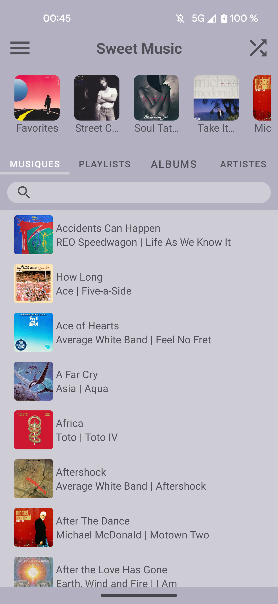
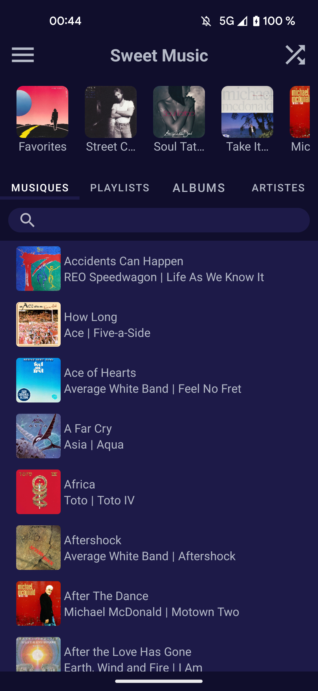
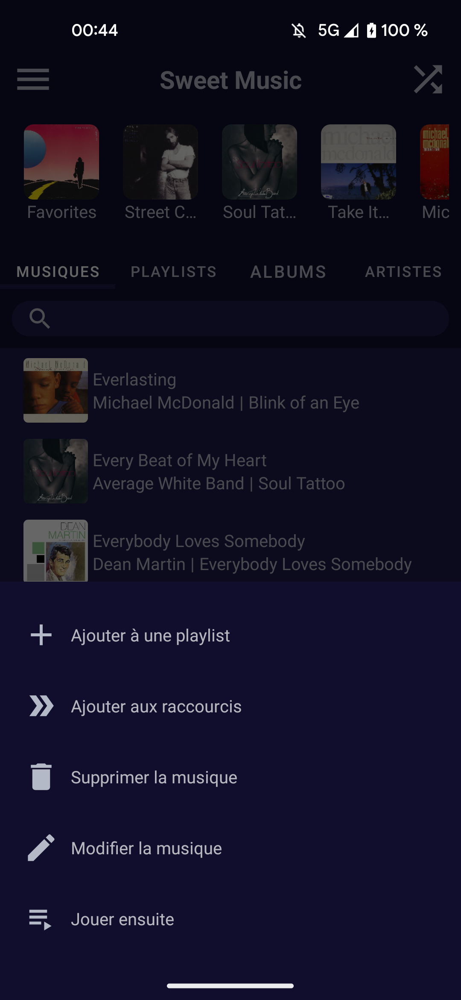
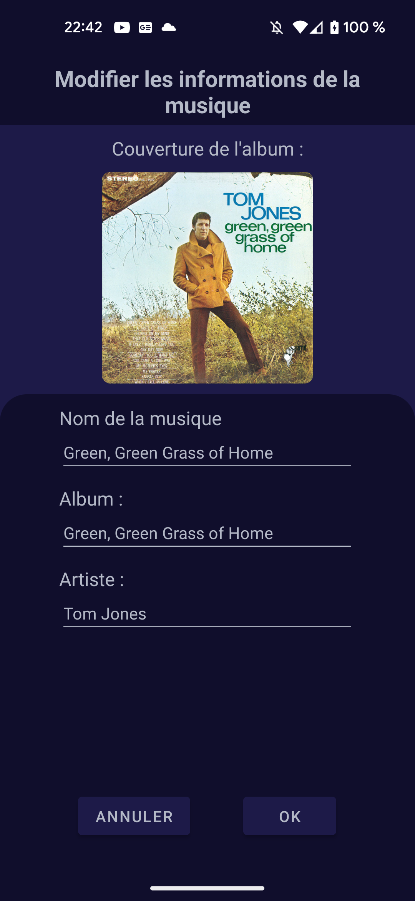
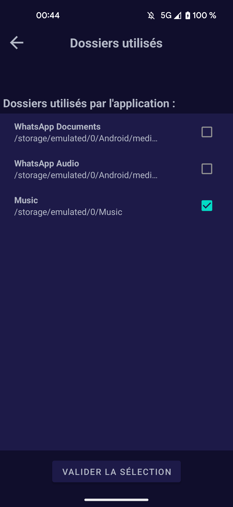
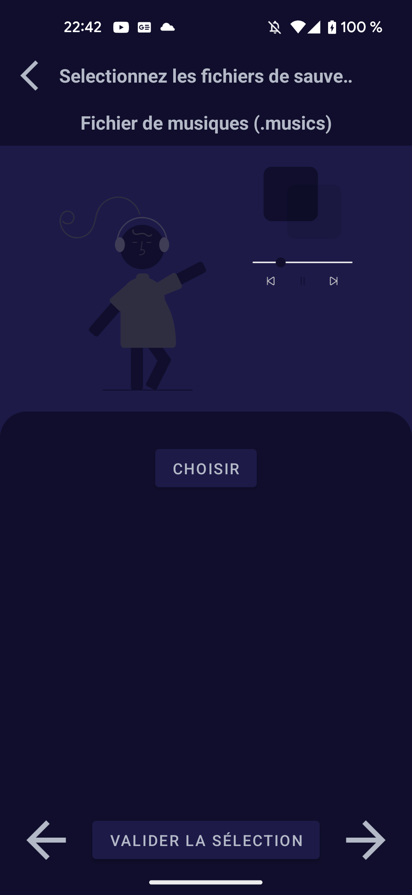
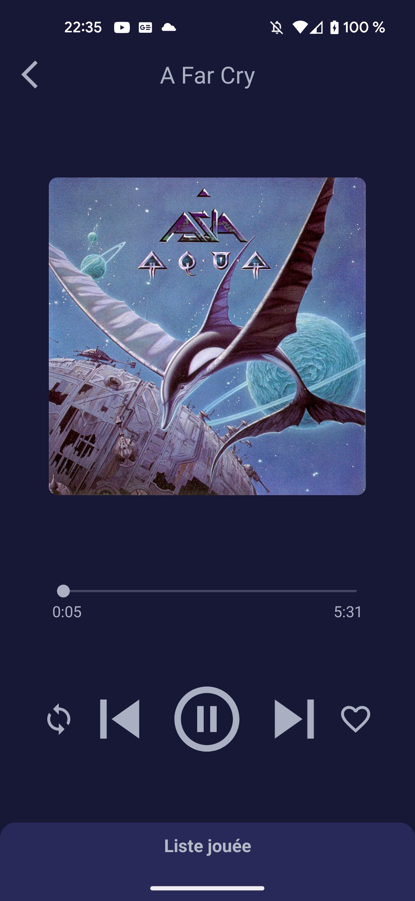
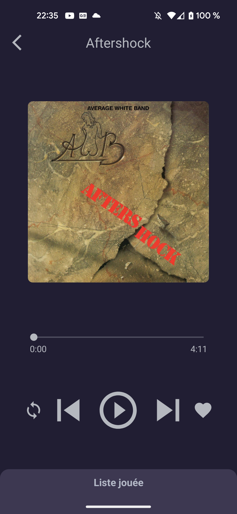
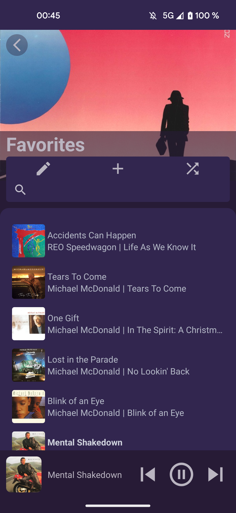
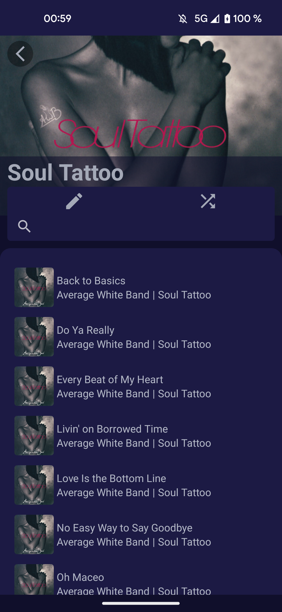

# Sweet Music (previously named MusicPlayer)

A simple offline music player for Android 10 and above.

## General look :
Sweet Music proposes two color theme that depend on the theme of your device :

  
  

## Functionalities :
### Music related functionalities :
- Listen to all the songs on your device
- Multiple playing mode :
  - normal
  - random
  - looped on one song
- Deleting songs from the app and store them in a list in the settings if you want to retrieve them
- Create playlists and manage them
- Modify songs, playlists and albums :
  - Modifying a song without setting an album cover will let the app search for an album cover used in the app that matches the correct album
  - Modifying an album will modify all the songs inside it
- Create shortcuts in the main menu to rapidly access musics, playlists, albums or artists
- Manage the played queue directly in the music player page or a notification
- Search for what you want with the differents search bar in the app

  
  
  

### Settings :
The settings of this app let you manage the folders used by the application.

  

### Saving your data :
All your music data (musics and playlists) can be retrieved in your Download folder.
These can be useful when you need a backup of your files (when you change your device for example).
You can retrieve your data and set it directly in the app.

  

### Dynamic Color theme :
The music player page theme depends of the color of the album art of the played music :

  
  

Finally, the playlists, albums and artists color theme depend of the cover of the list :

  
  

