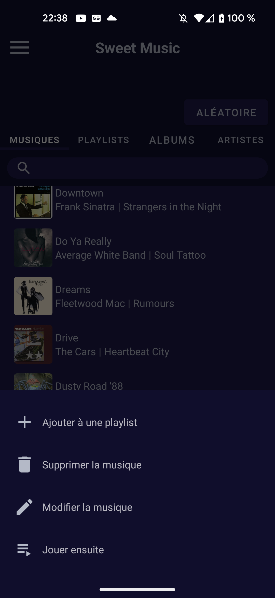
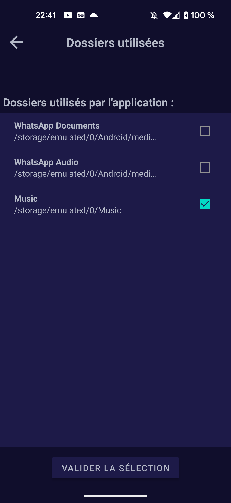
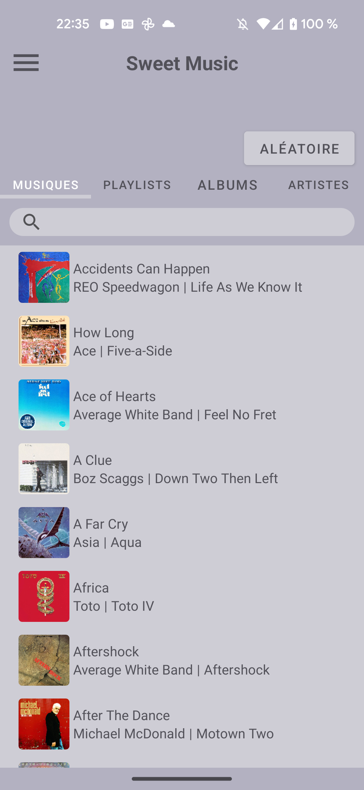
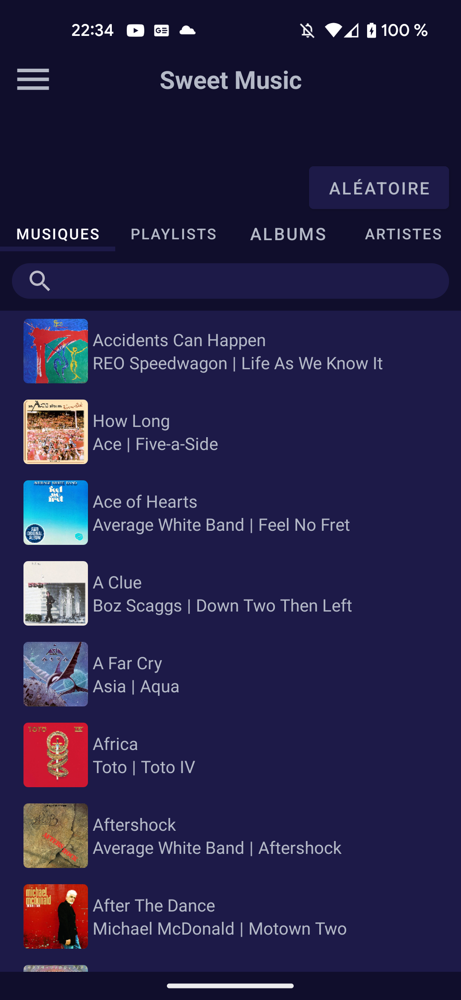
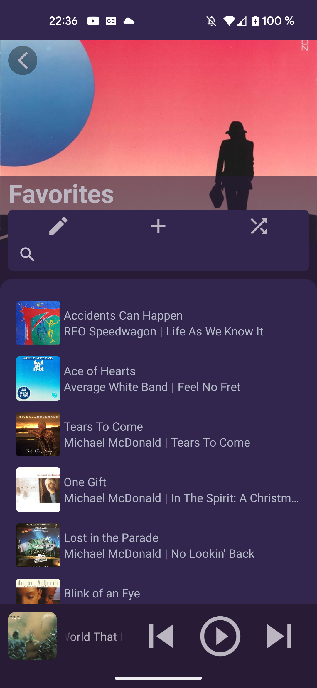
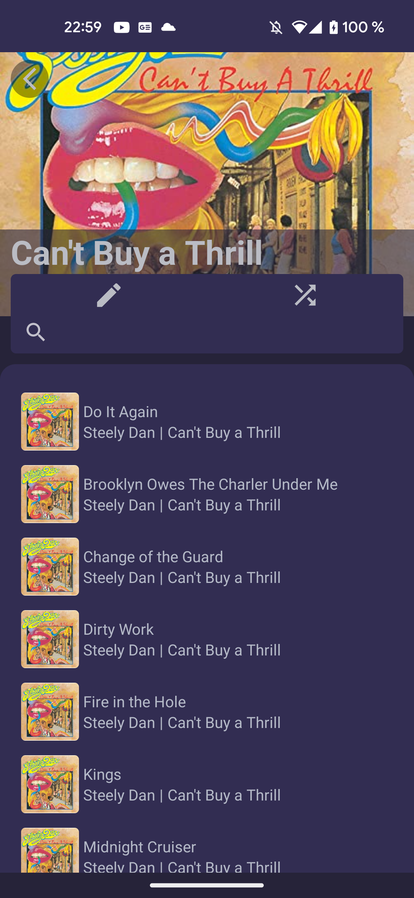

# Sweet Music (previously named MusicPlayer)

A simple offline music player.

## Functionalities :
### Music related functionalities :
With this app, you can listen to all the songs on your device.
You can also create playlists and manage them.

Songs can be modified, added to the played queue or deleted from the app.
Modifying a song without setting an album cover will let the app search for an album cover used in the app that matches the correct album.
Modifying an album will modify all the songs inside it.

You can manage the played queue directly in the music player page :

A music notification gives you the possibility to manage the played queue.
Finally, multiple search bars let you find what you want in the app.

### Settings :
The settings of this app let you manage the folders used by the application.

### Saving your data :
All your music data (musics and playlists) can be retrieved in your Download folder.
These can be useful when you need a backup of your files (when you change your device for example).
You can retrieve your data and set it.

### Color theme :
Principal Color theme depending of your device theme :

Light theme :

Dark theme :

The music player theme depends of the color of the album art of the played music :

Finally, the playlists, albums and artists color theme depend of the cover :

